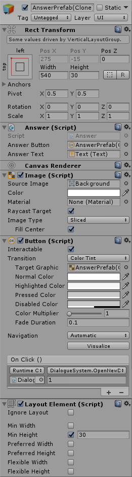

Answer Prefab
===============

### Основное

@DialogueSystemScripts.Models.Answer  
@DialogueSystemScripts.Models.AnswerSettings

Префаб кнопки ответа, который может быть настроен дизайнером, однако должен иметь компонент "Layout Element" для корректного отображения в окне диалога.

###Answer Button
Объект типа "Button", кнопка ответа в диалоге.

###Text
Объект типа "Text" для вывода текста ответа.