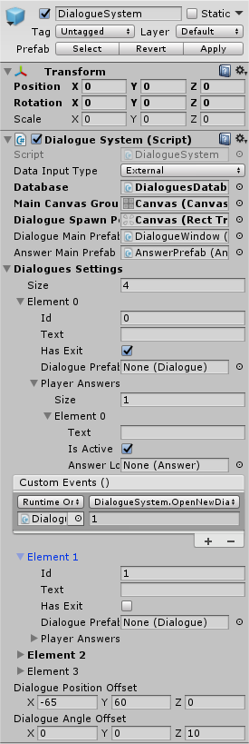

Dialogue System
===============

###Основное

Диалог создается при помощи метода @DialogueSystemScripts.DialogueSystem.OpenNewDialogue(System.Int32).

> [!WARNING]
> При создании нового диалога - предыдущий диалог не закрывается, а становится неактивным.

Для того, что бы закрыть текущий диалог используется метод @DialogueSystemScripts.DialogueSystem.CloseCurrentDialogue.

Также возможно закрыть все текущие открытые диалоги(в т.ч. неактивные). Для этого используется метод @DialogueSystemScripts.DialogueSystem.CloseAllDialogues.

####Дополнительная Информация
@DialogueSystemScripts.DialogueSystem

### Hierarchy

### Data Input Type
Тип выбора данных(текстов) для диалогов:
+ Direct - выборка данных из @DialogueSystemScripts.Models.DialogueSettings.
+ External - выборка данных из объекта @DialogueSystemScripts.DialoguesDatabase.

### Database
Объект типа @DialogueSystemScripts.DialoguesDatabase, из которого идет выборка данных для диалогов.

> [!NOTE]
> При использовании ввода данных через XML-файл необходимо указывать корректные значения "Size" массива @DialogueSystemScripts.Models.AnswerSettings. XML-файл данных используется только для изменения значений "Text" в @DialogueSystemScripts.Models.DialogueSettings и @DialogueSystemScripts.Models.AnswerSettings.

####Дополнительная Информация
@xml_dialogues_db  
@DialogueSystemScripts.DialoguesDatabase  
@DialogueSystemScripts.XML_DialoguesDatabase

### Main Canvas Group
Объект типа "Canvas Group".  
Необходим для блокирования управления вне диалогового окна.

### Dialogue Spawn Point
Объект типа "RectTransform".  
Необходим для указания объкта, в котором будет происходить создание диалогового окна.  
Если не задан, то по умолчанию устанавливается объект "Main Canvas Group".

### Dialogue Main Prefab
Префаб диалогового окна типа @DialogueSystemScripts.Models.Dialogue.

####Дополнительная Информация
@dialogue_window_prefab  
@DialogueSystemScripts.Models.Dialogue

### Answer Main Prefab
Префаб кнопки ответа окна типа @DialogueSystemScripts.Models.Answer.

####Дополнительная Информация
@answer_prefab  
@DialogueSystemScripts.Models.AnswerSettings  
@DialogueSystemScripts.Models.Answer

### Dialogues Settings
Массив объектов типа @DialogueSystemScripts.Models.DialogueSettings.  
Size - размер массива, количество диалогов.

####Дополнительная Информация
@DialogueSystemScripts.Models.DialogueSettings

> [!NOTE]
> При использовании ввода данных через XML-файл необходимо указывать корректные значения "Size" массива @DialogueSystemScripts.Models.AnswerSettings. XML-файл данных используется только для изменения значений "Text" в @DialogueSystemScripts.Models.DialogueSettings и @DialogueSystemScripts.Models.AnswerSettings.

### Dialogue Position Offset
Значения, на которые будет сдвинуто текущее диалоговое окно при открытии нового диалогового окна.

###Dialogue Rotation Offset
Значения, на которые будет повернуто текущее диалоговое окно при открытии нового диалогового окна.